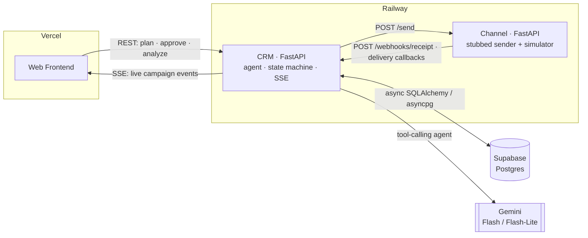

# Loop

Loop is an autonomous marketing-campaign agent for **Brew & Co.**, a D2C coffee chain. Describe a goal in one sentence and a Gemini-powered agent segments the audience, picks the channel by data, drafts the message, projects performance, and launches — with live delivery tracking and a mid-campaign channel-switch recommendation.

## Architecture



The CRM dispatches messages to the channel service; the channel simulates the delivery funnel (`delivered → read → opened → clicked → converted`) and POSTs idempotent callbacks back to the CRM, which advances a forward-only state machine and streams updates to the UI over SSE.

## Stack

- **Backend:** Python 3.13, FastAPI, SQLAlchemy 2.0 (async) + asyncpg, httpx
- **Database:** Supabase Postgres
- **AI:** Google Gemini via `google-genai` — `gemini-2.5-flash` (planning agent) and `gemini-2.5-flash-lite` (mid-campaign checks, per-customer explanations)
- **Realtime:** Server-Sent Events
- **Deploy:** Frontend on Vercel · two FastAPI services on Railway

## Quickstart (local)

```bash
# from the repo root — set up one venv for both services
python -m venv .venv && . .venv/bin/activate   # Windows: . .venv/Scripts/activate
pip install -r crm/requirements.txt -r channel/requirements.txt

# add your .env (see below), then optionally seed demo data
python seed/seed.py

# run the two services (separate terminals)
uvicorn app.main:app --app-dir channel --port 8001
uvicorn app.main:app --app-dir crm --port 8000
```

CRM at `http://localhost:8000`, channel at `http://localhost:8001`. Health check: `GET /health`.

## Environment variables

Create a `.env` in the repo root (never commit it):

| Variable | Description |
|---|---|
| `DATABASE_URL` | Supabase Postgres connection string (`postgresql://…`; the async engine rewrites the scheme to `asyncpg`) |
| `CRM_URL` | Base URL the channel service uses to call back into the CRM |
| `CHANNEL_URL` | Base URL the CRM uses to dispatch messages to the channel service |
| `DEMO_SPEED` | Divides every simulator delay to speed up demos (default `1`) |
| `RIG_LOW_DELIVERY_CHANNEL` | Force one channel's delivery rate low to trigger the mid-campaign-switch demo (e.g. `whatsapp`; empty to disable) |
| `GEMINI_API_KEY` | Google Gemini API key |
| `GEMINI_MODEL` | Model for the planning agent (`gemini-2.5-flash`) |
| `GEMINI_MODEL_LITE` | Lighter model for mid-campaign checks and customer explanations (`gemini-2.5-flash-lite`) |

## Live URLs

> Replace with your deployment URLs.

- **App:** `https://loop-frontend-nine.vercel.app/`
- **CRM API:** `loop-backend-production-c717.up.railway.app`
- **Channel API:** `charismatic-upliftment-production-4abe.up.railway.app`

## More

- [TRADEOFFS.md](TRADEOFFS.md) — design decisions and what was deliberately left out
- [AI_WORKFLOW.md](AI_WORKFLOW.md) — how the agent and AI tooling are built
